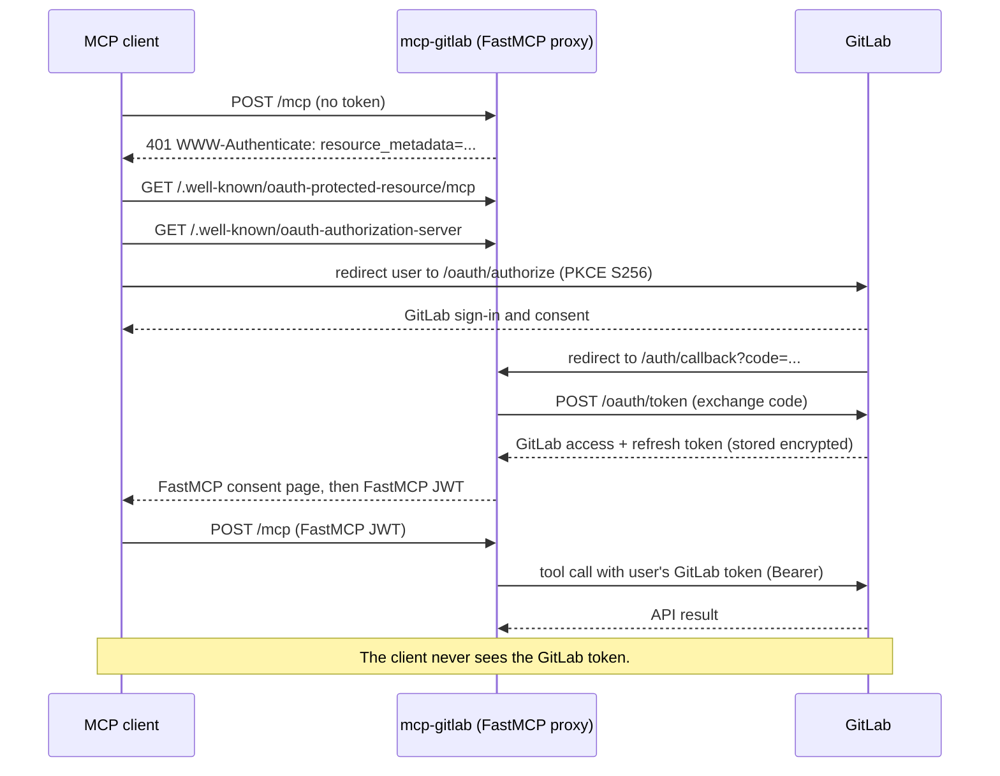

# OAuth 2.1 mode (opt-in)

mcp-gitlab runs with a static GitLab token by default. Pass `--auth oauth` to
run it instead as an MCP 2026-07-28 resource server in front of GitLab. Each
user then signs in with their own GitLab account, and every request runs with
that user's token. This guide covers when to use it, how the flow works, how to
register the GitLab app, and how to deploy and connect clients.

OAuth mode shipped in mcp-gitlab 0.13.0.

## 1. When to use OAuth vs token mode

Use token mode (`--auth token`, the default) for a single-user, local setup:
set `GITLAB_TOKEN` and run over `stdio`. Use OAuth mode when you host one server
for several people: no personal access token sits on the server, each user
authenticates with their own GitLab account, and every GitLab call runs under
that user's identity and permissions. OAuth mode requires the
`streamable-http` transport.

## 2. How the flow works

1. The MCP client posts to `<base>/mcp` with no token.
2. The server returns `401` with `WWW-Authenticate: Bearer resource_metadata="<base>/.well-known/oauth-protected-resource/mcp"`.
3. The client fetches that protected-resource metadata (RFC 9728).
4. The client reads the authorization-server metadata at `<base>/.well-known/oauth-authorization-server` (RFC 8414).
5. The client registers and sends the user to GitLab at `<GITLAB_URL>/oauth/authorize` with PKCE S256.
6. The user signs in to GitLab and approves the requested scopes.
7. GitLab redirects to `<base>/auth/callback` with an authorization code.
8. The server exchanges the code at `<GITLAB_URL>/oauth/token` and stores the GitLab token encrypted, server-side.
9. The server shows its own consent page, then issues a FastMCP JWT to the client.
10. The client retries `<base>/mcp` with that JWT.
11. On each tool call, the server swaps the JWT for the user's stored GitLab token and calls GitLab with `Authorization: Bearer`.

The client holds only the FastMCP JWT. It never receives the GitLab token.



## 3. Register the GitLab application

Register one GitLab OAuth application. Pick the scope that matches the owner.

On gitlab.com or self-managed, for a user-owned application:

1. Select your avatar, then **Edit profile**.
2. In the left sidebar, select **Applications**.
3. Select **Add new application**.

For a group-owned application, go to the group, then **Settings → Applications**.

For an instance-wide application on self-managed GitLab, you need administrator
access; go to **Admin → Applications → New application**.

Then, for every application:

1. Enter a **Name**.
2. Set the **Redirect URI** to `<GITLAB_OAUTH_BASE_URL>/auth/callback`.
3. For `https://mcp.example.com`, enter `https://mcp.example.com/auth/callback`.
4. Select the **Confidential** checkbox.
5. Grant the `api` scope, or `read_api` for a read-only deployment.
6. Select **Save application**.
7. Copy the **Application ID** and **Secret**.

The redirect path `/auth/callback` is the FastMCP proxy default; the server does
not change it. The application must be confidential: the server authenticates to
GitLab with the secret, so `GITLAB_OAUTH_CLIENT_SECRET` is required. Grant `api`
for full read/write access, or `read_api` for a server that must never write.

Source: GitLab's OAuth provider documentation describes these registration
paths and fields.

## 4. Run locally for a first test

Use a loopback base URL for the first test. Register a user-owned application
first, with redirect URI `http://localhost:8000/auth/callback` and scope `api`.

Run the server:

```bash
GITLAB_URL=https://gitlab.com \
GITLAB_AUTH=oauth \
GITLAB_OAUTH_CLIENT_ID=<application-id> \
GITLAB_OAUTH_CLIENT_SECRET=<secret> \
GITLAB_OAUTH_BASE_URL=http://localhost:8000 \
  uvx mcp-gitlab --transport streamable-http --auth oauth
```

Confirm the server answers with a `401` challenge:

```bash
curl -si http://localhost:8000/mcp -X POST \
  -H 'content-type: application/json' -d '{}'
```

Confirm discovery resolves to the loopback host:

```bash
curl -s http://localhost:8000/.well-known/oauth-protected-resource/mcp
```

GitLab accepts an `http://localhost` or `http://127.0.0.1` redirect URI. GitLab's
OAuth provider documentation states that a non-SSL redirect URL is allowed,
though an SSL URL is preferred; loopback HTTP is the standard choice for local
OAuth clients.

## 5. Deploy remotely

Serve OAuth mode over HTTPS. The MCP SDK rejects a non-HTTPS issuer URL unless
the host is loopback: it raises `Issuer URL must be HTTPS` when the scheme is not
`https` and the host is not `localhost`, `127.0.0.1`, or `[::1]`
(`mcp/server/auth/routes.py:37`). Set `GITLAB_OAUTH_BASE_URL` to the public HTTPS
URL and terminate TLS at a reverse proxy.

1. Bind the server to all interfaces behind the proxy with `--host 0.0.0.0`.
2. Set `GITLAB_OAUTH_BASE_URL` to the public URL, for example `https://mcp.example.com`.
3. Set `FASTMCP_HOME` to a persistent directory; the encrypted token store lives at `$FASTMCP_HOME/oauth-proxy/<fingerprint>/`.
4. Set `GITLAB_OAUTH_JWT_KEY` to a random string of at least 32 characters.
5. Register the GitLab redirect URI as `<public-url>/auth/callback`.

```bash
GITLAB_URL=https://gitlab.com \
GITLAB_AUTH=oauth \
GITLAB_OAUTH_CLIENT_ID=<application-id> \
GITLAB_OAUTH_CLIENT_SECRET=<secret> \
GITLAB_OAUTH_BASE_URL=https://mcp.example.com \
GITLAB_OAUTH_JWT_KEY=<32+ random chars> \
FASTMCP_HOME=/var/lib/mcp-gitlab \
  uvx mcp-gitlab --transport streamable-http --auth oauth \
  --host 0.0.0.0 --port 8000
```

Set `GITLAB_OAUTH_JWT_KEY` explicitly in production. Without it, the signing key
derives from the client secret, so rotating the secret invalidates every stored
client registration and forces each user to re-authorize.

Run a single server instance against one `FASTMCP_HOME`. The token store is a
local encrypted file tree, not a shared backend, so two processes sharing one
directory are not coordinated. This build configures no shared storage.

## 6. Connect clients

Each client connects to the resource URL `<base>/mcp` and runs the OAuth flow in
a browser. The examples use `https://mcp.example.com/mcp`.

### Claude Code

Add the server over HTTP, then authorize it:

```bash
claude mcp add --transport http gitlab https://mcp.example.com/mcp
```

Run `/mcp` inside a session and follow the browser steps to sign in. Claude Code
flags the server for authentication when it returns `401` or `403`. The `/mcp`
menu also offers **Re-authenticate** and **Clear authentication**. Source: Claude
Code MCP documentation.

### Cursor

Add the server to `.cursor/mcp.json` (project) or `~/.cursor/mcp.json` (global):

```json
{
  "mcpServers": {
    "gitlab": {
      "url": "https://mcp.example.com/mcp"
    }
  }
}
```

A remote entry uses `url` and no `command`. Cursor runs the OAuth flow when the
server requires it. Source: Cursor MCP documentation.

### VS Code (Copilot)

Add the server to `.vscode/mcp.json` under the `servers` key:

```json
{
  "servers": {
    "gitlab": {
      "type": "http",
      "url": "https://mcp.example.com/mcp"
    }
  }
}
```

Set `"type": "http"` for a remote server. Source: VS Code MCP servers
documentation.

### MCP Inspector

Launch the Inspector:

```bash
pnpm dlx @modelcontextprotocol/inspector
```

In the web UI, set the transport to **Streamable HTTP** and enter
`https://mcp.example.com/mcp`. Connect, then complete the browser sign-in.
Source: MCP Inspector repository.

## 7. Scopes and read-only

Three settings control whether writes are allowed:

- `GITLAB_OAUTH_SCOPES` sets the scopes required on every request; the default is `api`.
- The user's GitLab token carries the scopes GitLab issued, such as `api` or `read_api`.
- `GITLAB_READ_ONLY=true` disables every write in both auth modes.

GitLab's `api` scope implies `read_api`, so an `api` token reads and writes. A
write tool first calls `_check_write`. When `GITLAB_READ_ONLY` is true, the tool
returns:

> Server is in read-only mode. Set GITLAB_READ_ONLY=false to enable writes.

When the token lacks the `api` scope in OAuth mode, the tool returns:

> Re-authorize with the 'api' scope, or ask the operator to set GITLAB_OAUTH_SCOPES=api.

When `GITLAB_OAUTH_SCOPES=api` but a user presents a `read_api`-only token, the
server returns `403` with `error="insufficient_scope"` and `scope="api"` before
the tool runs. Set `GITLAB_OAUTH_SCOPES=read_api` to run a read-only deployment
where writes are refused with the scope hint above.

## 8. Tokens

GitLab access tokens expire; the token response reports `expires_in: 7200`, which
is two hours. Refresh tokens outlive access tokens and rotate: a refresh
invalidates the old access and refresh tokens and returns new ones. The server
stores the refresh token encrypted and refreshes the GitLab token transparently
when it expires. The MCP client keeps its own FastMCP JWT and is not affected.

To revoke access, open GitLab **Settings → Applications → Authorized
applications**, find the server's application, and select **Revoke**. After
revocation, the server can no longer refresh the token, so the next tool call
returns `401` and the client re-authorizes. Source: GitLab OAuth documentation.

## 9. Troubleshooting

| Symptom | Cause | Fix |
|---|---|---|
| `redirect_uri` mismatch at GitLab sign-in | The registered redirect URI differs from `<GITLAB_OAUTH_BASE_URL>/auth/callback` | Set the GitLab application redirect URI to exactly `<base>/auth/callback`, including scheme and port |
| `401` with `error="invalid_token"` | The JWT is unknown, expired, or the upstream GitLab token was revoked | Re-authorize in the client; use **Re-authenticate** or `/mcp` |
| `403` with `error="insufficient_scope"`, `scope="api"` | The user's token has `read_api` but the server requires `api` | Re-authorize granting `api`, or set `GITLAB_OAUTH_SCOPES=read_api` for a read-only server |
| `--auth oauth requires --transport streamable-http` | OAuth was requested on `stdio` or `sse` | Add `--transport streamable-http`, or use `--auth token` for stdio |
| `OAuth mode requires: GITLAB_OAUTH_CLIENT_ID, ...` | A required OAuth variable is unset | Set `GITLAB_OAUTH_CLIENT_ID`, `GITLAB_OAUTH_CLIENT_SECRET`, and `GITLAB_OAUTH_BASE_URL` |
| `Issuer URL must be HTTPS` | `GITLAB_OAUTH_BASE_URL` is `http://` on a non-loopback host | Serve over HTTPS; use `http://` only for `localhost` or `127.0.0.1` |
| TLS errors reaching a self-signed GitLab | The server verifies the GitLab certificate | Set `GITLAB_SSL_VERIFY=false` for a trusted self-signed instance only |
| Users forced to re-authorize after a secret change | `GITLAB_OAUTH_JWT_KEY` is unset, so the key derives from the client secret | Set a stable `GITLAB_OAUTH_JWT_KEY` of at least 32 characters |

## 10. Validation checklist

Test the deployment with a real GitLab account:

- [ ] Register the GitLab application with redirect URI `<base>/auth/callback`, confidential, scope `api`.
- [ ] Run the server with `--transport streamable-http --auth oauth` and the OAuth variables set.
- [ ] Connect a client to `<base>/mcp` and complete the GitLab sign-in and consent.
- [ ] Call a read tool, such as `gitlab_get_project`, and confirm it succeeds.
- [ ] Call a write tool, such as `gitlab_create_issue`, and confirm it succeeds.
- [ ] Repeat with a `read_api`-only token and confirm writes are refused with the scope hint.
- [ ] Revoke the application in GitLab **Settings → Applications → Authorized applications**.
- [ ] Trigger another tool call, confirm a `401`, and confirm the client re-authorizes.
